# Comprehensive Academic Technical Report: TikTok Arcade Mobile

**Course**: CS 206 - Programming Languages (PL)  
**Evaluation Parameters**: 30% Technical Report + 35% System Functionality + 5% Elective Concepts  
**Project System**: TikTok Arcade Mobile (30-Game Decathlon Run Container)  
**Developer/Student**: Reyhan İmece  
**Repository**: [mrreybot/TikTokerGame](https://github.com/mrreybot/TikTokerGame)  
**Date**: June 8, 2026  

---

## 1. Introduction & Academic Framework

This academic technical report provides an exhaustive, compiler- and interpreter-level analysis of **TikTok Arcade Mobile** from a Programming Languages (PL) perspective. Designed as a single, zero-dependency integrated web application, the system contains 30 distinct mini-games arranged in a circular, doubly-linked structure. Designed specifically for vertical mobile viewports (simulating a fixed logical resolution of 400x800), the entire application is written in vanilla **ECMAScript 6 (ES6) JavaScript**, **HTML5 Canvas**, and **Vanilla CSS3**. It avoids all third-party UI libraries (e.g., React, Vue, Angular) and external physics engines (e.g., Matter.js, Phaser, PixiJS).

From a PL design standpoint, vanilla JavaScript represents a rich environment for studying the tradeoffs of dynamic typing, prototypical inheritance, lexical scoping, closures, asynchronous event loops, and dynamic memory layouts. The core objective of this project is to implement a complete interactive system and analyze the theoretical and practical programming language concepts that govern its execution. 

Over the following sections, we will analyze the application's design through key concepts of programming language theory, including:
1. **Values and Types**: Value representation (IEEE 754 float representation), memory representation of primitives vs. references, copy semantics (copy-by-value vs. copy-by-reference), and implicit coercion rules.
2. **Storage and Memory Management**: Stack allocation mechanics (activation records), heap allocation of dynamic types, garbage collection (GC) reachability analysis via the Mark-and-Sweep algorithm, and preventing memory leaks in persistent loops.
3. **Names, Scopes, and Bindings**: Binding times (design, implementation, compile, load, run), lexical scoping rules, block scope (`let`/`const`) vs. function scope (`var`), scope chains, environment records, and variable shadowing.
4. **Functions, Subprograms, and Closures**: Parameter-passing mechanisms (pass-by-sharing), call stacks, activation records, higher-order functions (callbacks), arrow functions, and the lexical preservation of closures.
5. **Abstraction and Encapsulation**: Interface vs. implementation separation, simulating abstract classes, private class fields (`#`), accessors (getters/setters), and transaction rollbacks for robust state transition.
6. **Type Systems**: Dynamic vs. static typing, type equivalence models (duck typing), and runtime defensive type checks.
7. **Control Flow and Concurrency**: Sequencing, iteration vs. recursion, depth-first search (DFS) flow, the JS Event Loop (macrotasks vs. microtasks), Promises, async/await, and frame scheduling via `requestAnimationFrame`.
8. **Object-Oriented Programming (OOP) and Objects**: Prototypical inheritance chains, dynamic polymorphic dispatch, class syntax sugar, and the mechanics of the `this` keyword binding rules.
9. **Custom Data Structures & Algorithms**: Custom pointer-based implementations of a Circular Doubly Linked List, LIFO Stack, and Sorted Linked List.
10. **Engineering Challenges**: Solving double event dispatch, coordinate translation math, and gesture conflict resolution.

---

## 2. High-Level System Architecture & Component Relationships

The application is structured around a modular, event-driven architecture that separates the data structure containers, the frame scheduling pipeline, the global orchestrator, and the polymorphic game modules.

```mermaid
classDiagram
    class App {
        -#engine: GameEngine
        -#leaderboard: LinkedList
        -#gameList: CircularDoublyLinkedList
        -#currentUsername: String
        -#activeGameName: String
        -#storageKey: String
        -#db: Firestore
        -#isDbOnline: Boolean
        -#arcadeTotalScore: Number
        -#gamesPlayedCount: Number
        +constructor()
        -#initializeGameList()
        -#buildLobbyGamesGrid()
        -#setupDOMListeners()
        -#runArcade(startNode)
        -#buildPaginationDots()
        -#updateActiveGameUI(metadata)
        -#handleGameOver(gameScore)
        -#saveScore(username, score)
        -#loadLeaderboardData()
        -#saveLeaderboardData()
        -#updateLeaderboardUI()
    }
    class GameEngine {
        -#canvas: HTMLCanvasElement
        -#ctx: CanvasRenderingContext2D
        -#lastTime: Number
        -#animationFrameId: Number
        -#activeGame: GameBase
        -#isRunning: Boolean
        -#activeNode: CircularDoublyLinkedListNode
        -#onGameOverCallback: Function
        -#onActiveGameChangedCallback: Function
        -#swipeStartY: Number
        -#swipeStartX: Number
        -#swipeYOffset: Number
        -#isSwiping: Boolean
        -#isSlidingTransition: Boolean
        -#slideProgress: Number
        -#slideDirection: Number
        -#slideDuration: Number
        -#slideTimeElapsed: Number
        -#startSwipeYOffset: Number
        -#gravity: Number
        +constructor(canvasId)
        +resizeCanvas()
        +setupArcade(activeNode, onGameOverCallback, onActiveGameChangedCallback)
        +triggerSwipeNext()
        +loadGameFromActiveNode()
        -#setupInputListeners()
        +applyGravityPhysics(state, dt)
        +runGame(gameInstance)
        +stop()
        -#update(dt)
        -#render()
        +drawPreviewCard(ctx, name, icon, color, yOffset)
    }
    class GameBase {
        +engine: GameEngine
        +canvas: HTMLCanvasElement
        +onGameOver: Function
        +score: Number
        +isGameOver: Boolean
        +constructor(engine, onGameOverCallback)
        +init()*
        +update(dt)*
        +render(ctx)*
        +handleInput(x, y, event)*
        +drawNeonRect(ctx, x, y, w, h, fillColor, strokeColor, glowColor, glowBlur)
        +drawNeonCircle(ctx, x, y, radius, fillColor, strokeColor, glowColor, glowBlur)
        +drawNeonText(ctx, text, x, y, font, color, align, glowColor, glowBlur)
    }
    class FallGame {
        -#livesStack: Stack
        -#gameState: String
        -#countdownTimer: Number
        -#ball: Object
        -#gate: Object
        -#timeElapsed: Number
        -#baseGravityBoost: Number
        -#maxFallY: Number
        -#rippleRings: Array
        -#shakeTimer: Number
        -#shakeMagnitude: Number
        +init()
        +update(dt)
        +render(ctx)
        +handleInput(x, y, event)
        -#resetBall()
        -#triggerShake(duration, magnitude)
        -#deductLife()
        -#updateRipples(dt)
        -#checkTap()
    }
    class SortGame {
        -#tubes: Array
        -#selectedTubeIndex: Number
        -#gameState: String
        -#timeElapsed: Number
        -#rippleRings: Array
        +init()
        +update(dt)
        +render(ctx)
        +handleInput(x, y, event)
        -#attemptTransfer(fromIdx, toIdx)
        -#checkWinCondition()
    }
    class Node {
        +value: Any
        +next: Node
        +constructor(value)
    }
    class Stack {
        -#top: Node
        -#size: Number
        -#limit: Number
        +constructor(limit)
        +push(value)
        +pop()
        +peek()
        +isEmpty()
        +size: Number
        +toArray()
        +clear()
    }
    class ScoreNode {
        +name: String
        +score: Number
        +timestamp: String
        +next: ScoreNode
        +constructor(name, score)
    }
    class LinkedList {
        -#head: ScoreNode
        -#size: Number
        -#maxSize: Number
        +constructor(maxSize)
        +insertSorted(name, score)
        -#trimList()
        +head: ScoreNode
        +size: Number
        +toArray()
        +clear()
    }
    class CircularDoublyLinkedListNode {
        +value: Any
        +next: CircularDoublyLinkedListNode
        +prev: CircularDoublyLinkedListNode
        +constructor(value)
    }
    class CircularDoublyLinkedList {
        -#head: CircularDoublyLinkedListNode
        -#tail: CircularDoublyLinkedListNode
        -#size: Number
        +insert(value)
        +head: CircularDoublyLinkedListNode
        +tail: CircularDoublyLinkedListNode
        +size: Number
        +toArray()
    }

    App --> GameEngine : controls
    App --> CircularDoublyLinkedList : sequences games
    App --> LinkedList : manages leaderboard
    GameEngine --> GameBase : executes polymorphically
    GameBase <|-- FallGame : extends
    GameBase <|-- SortGame : extends
    CircularDoublyLinkedListNode --> CircularDoublyLinkedListNode : links circular doubly
    CircularDoublyLinkedList --> CircularDoublyLinkedListNode : contains
    Stack --> Node : links singly
    LinkedList --> ScoreNode : links singly
    FallGame --> Stack : tracks lives
    SortGame --> Stack : models tubes
```



### Module Descriptions
1. **Application Orchestrator ([App.js](file:///Users/reyhanimece/Desktop/Seng206Project/App.js))**: Acts as the central state machine. It manages the decathlon sequence counters (`#gamesPlayedCount` and `#arcadeTotalScore`), coordinates transitions between HTML views (Lobby, Game View, Leaderboard), builds the lobby game cards dynamically, and handles high-score persistence to Firebase Firestore with an offline fallback to `localStorage`.
2. **Graphics & Physics Engine ([Engine.js](file:///Users/reyhanimece/Desktop/Seng206Project/Engine.js))**: Responsible for frame scheduling and rendering coordination. It implements a fixed-logical dimension scaling layer (translating hardware screen mouse/touch matrices to a fixed 400x800 logical frame), coordinates the vertical swipe-to-transition animation, and houses the manual gravity physics integration subroutine.
3. **Polymorphic Base ([games/GameBase.js](file:///Users/reyhanimece/Desktop/Seng206Project/games/GameBase.js))**: Establishes the dynamic dispatch contract. Every mini-game extends `GameBase` and overrides its core lifecycle methods. It also provides shared procedural rendering wrappers for glowing graphics.
4. **Data Structures Module ([DataStructures.js](file:///Users/reyhanimece/Desktop/Seng206Project/DataStructures.js))**: Implements low-level dynamic memory structures. It avoids all native array wrapper features (e.g., `shift`, `unshift`, `sort`) to construct custom pointer-linked structures for lists, stacks, and circular chains.
5. **Concrete Game Scripts ([games/FallGame.js](file:///Users/reyhanimece/Desktop/Seng206Project/games/FallGame.js), [games/SortGame.js](file:///Users/reyhanimece/Desktop/Seng206Project/games/SortGame.js), [games/NewMiniGames.js](file:///Users/reyhanimece/Desktop/Seng206Project/games/NewMiniGames.js))**: Implement the logic and rendering parameters of the 30 games.

---

## 3. Values and Types (Theoretical Foundations & Empirical Analysis)

Programming languages organize data into types to determine how bit patterns are represented, which operators are valid on those patterns, and how memory is allocated. JavaScript employs a dual value type model: **Primitives** and **Objects**.

### Primitive Values vs. Reference Types
Primitives represent immutable, raw values stored directly on the stack. Objects (Reference Types) represent mutable collections allocated on the heap, with stack variables holding pointers to their heap addresses.

| Value Category | JavaScript Types | Mutability | Storage Region | Copy Semantics |
| :--- | :--- | :--- | :--- | :--- |
| **Primitive** | `Number`, `String`, `Boolean`, `Null`, `Undefined`, `Symbol`, `BigInt` | Immutable | Stack | Copy-by-Value |
| **Reference** | `Object`, `Array`, `Function`, Class instances | Mutable | Heap | Copy-by-Reference |

#### IEEE 754 Floating-Point Representation
All numeric values in JavaScript are represented as 64-bit double-precision floating-point numbers conforming to the IEEE 754 standard. There is no separation between integer and float types in core JS. 
This is represented in our game logic:
```javascript
// From games/FallGame.js (Lines 44-46)
this.#timeElapsed = 0;
this.#baseGravityBoost = 0;
```
Under the hood, these values are stored as:
* **1 sign bit**
* **11 exponent bits**
* **52 significand (fraction) bits**

This representation implies that fractional increments, such as calculations of delta time (`dt = (timestamp - lastTime) / 1000`), can accumulate rounding errors (e.g., `0.1 + 0.2 === 0.30000000000000004`). To prevent collision checks from failing due to precision drift, our collision models rely on boundary ranges (`<=`, `>=`) rather than strict identity comparisons.

#### Immutability of Strings vs. Mutability of Objects
In JavaScript, primitive strings are immutable. Any operation that appears to modify a string actually allocates a new string in memory. References, however, point to mutable objects on the heap.
Consider the difference:
```javascript
// String manipulation (allocates a new string in memory every time)
this.timestamp = new Date().toLocaleDateString() + ' ' + new Date().toLocaleTimeString();

// Object manipulation (modifies the object structure in place on the heap)
this.#ball.y = 20; 
this.#ball.vy = 20;
```

### Deep vs. Shallow Copy Semantics
When assigning values or passing arguments, the runtime behavior depends on the type category:

```
VALUE COPY (Stack Primitive)
   Let a = 5;
   Let b = a;
   Stack:  [ a: 5 ]  [ b: 5 ]  (Independent memory slots)

REFERENCE COPY (Heap Object Pointer)
   Let state = { y: 200, velocity: 15 };
   Let copy = state;
   Stack:  [ state: Pointer A ] ──┐
           [ copy:  Pointer A ] ──┼──► Heap: { y: 200, velocity: 15 }
                                  │
                                  ▼
                        (Shared mutable state)
```

In [Engine.js](file:///Users/reyhanimece/Desktop/Seng206Project/Engine.js), the physics integration routine leverages reference copy semantics:
```javascript
// From Engine.js (Lines 273-287)
applyGravityPhysics(state, dt) {
    const accel = state.acceleration !== undefined ? state.acceleration : 0;
    state.velocity += (accel + this.#gravity) * dt; // Mutating heap reference directly
    state.y += state.velocity * dt;                 // Mutating heap reference directly
}
```
When a game calls `this.engine.applyGravityPhysics(this.#ball, dt)`, the variable `this.#ball` is passed as a stack reference copying the pointer to the heap object. Inside `applyGravityPhysics`, mutations to `state.y` and `state.velocity` directly alter the values stored in the heap block. This allows the calling game class to see the updated physics calculations immediately without needing to return the object.

### Type Coercion and Strict Equivalence
JavaScript is a **weakly typed** language. If operators are applied to mismatched types, the engine performs implicit type conversion (coercion) based on standard rules (e.g., converting a number to a string if concatenated with a string).

```javascript
// Implicit coercion
const msg = "Final Score: " + 100; // 100 is coerced to String "100"
```

In programming language design, this is contrasted with **strongly typed** languages (like Rust or Haskell) which require explicit conversions. To ensure strict validation and prevent coercion errors, our architecture uses strict equality operators (`===` and `!==`).

The loose equality operator (`==`) performs coercion:
```javascript
"3" == 3;   // true, due to conversion of "3" to number 3
"3" === 3;  // false, strict check requires type identity
```

We use strict equality throughout the core systems to prevent unexpected conversions:
```javascript
// From App.js (Line 365)
if (this.#gamesPlayedCount === 30) { ... } // Strict check: no coercion allowed
```

---

## 4. Storage, Variables, and Memory Management

A program's memory layout is partitioned into regions, primarily the **Stack** and the **Heap**, to manage the lifecycles and scopes of variables.

```
+-------------------------------------------------------------+
|                        STACK REGION                         |
| - Fast, LIFO access                                         |
| - Manages activation records (stack frames)                 |
| - Stores local parameters (x, y, dt)                        |
| - Stores reference pointers (addresses linking to Heap)     |
+-------------------------------------------------------------+
                               │
                               │ Pointers link stack to heap
                               ▼
+-------------------------------------------------------------+
|                         HEAP REGION                         |
| - Dynamic allocation                                        |
| - Managed by Garbage Collector                              |
| - Stores class instances, custom nodes, arrays              |
+-------------------------------------------------------------+
```

### The Activation Record (Stack Frame)
When a function is called, the runtime pushes an **Activation Record** (Stack Frame) onto the call stack. This frame contains:
1. **Local Parameters**: Inputs passed to the function.
2. **Local Variables**: Variables declared within the function scope.
3. **Return Address**: The instruction address to return to after execution.
4. **Outer Lexical Reference**: Pointer to the parent scope environment.

Consider a call to `handleInput` in `CatchFruitGame`:
```javascript
// From NewMiniGames.js
handleInput(x, y, event) {
    if (this.isGameOver) return;
    if (x >= 40 && x <= 160) {
        this.#basket.x = Math.max(40, this.#basket.x - 40);
    }
}
```

At the moment of tap execution, the call stack is arranged as follows:

```
+------------------------------------------------------------+
| Activation Frame: CatchFruitGame.handleInput               |
|  - Parameters: x = 85.5 (Number), y = 710.2 (Number)        |
|  - Local variables: none                                   |
|  - Return Address: Engine.js Line 219                      |
|  - Scope reference: CatchFruitGame Lexical Scope           |
+------------------------------------------------------------+
| Activation Frame: Engine.handleInputEvent                  |
|  - Parameters: clientX, clientY, e                         |
|  - Local variables: rect, x, y                             |
+------------------------------------------------------------+
| Activation Frame: Global Execution Context                 |
+------------------------------------------------------------+
```

Once the return statement is hit or execution reaches the end of the block, the frame is popped off the stack, and its local parameters and variables are deallocated immediately.

### Heap Allocation & Dynamic Structures
Dynamic allocation occurs when variables are created whose sizes or lifetimes cannot be determined at compile-time. This is handled using the `new` operator, which allocates memory on the heap.
```javascript
// From DataStructures.js (Lines 60-66)
const newNode = new Node(value);
newNode.next = this.#top;
this.#top = newNode;
```
1. `new Node(value)` reserves a block of memory in the heap for the `Node` object.
2. The constructor runs, initializing properties.
3. The starting address of this heap block is returned and stored in the stack variable `newNode`.
4. Setting `this.#top = newNode` links the class state to this heap address.

### Mechanics of Garbage Collection (GC)
Reclaiming unused heap memory is managed by the engine's garbage collector using a **Mark-and-Sweep** algorithm:
1. **Mark Phase**: The GC starts from a set of roots (active stack frames, global variables, DOM elements) and traverses all references. Every object reached is marked as "alive".
2. **Sweep Phase**: The GC scans the heap and reclaims memory for any objects that were not marked.

Our custom structures manage these references carefully to avoid memory leaks:
```javascript
// From DataStructures.js - trimList() (Lines 204-221)
#trimList() {
    if (this.#size <= this.#maxSize) return;
    let current = this.#head;
    for (let i = 1; i < this.#maxSize; i++) {
        if (current !== null) current = current.next;
    }
    // Severing the pointer link
    if (current !== null) {
        current.next = null; // Subsequent nodes are now unreachable
    }
}
```

```
BEFORE TRIMMING (Size = 11, Max = 10)
Root -> Head -> [Node 1] -> ... -> [Node 10] -> [Node 11] -> null

AFTER TRIMMING (Line: current.next = null)
Root -> Head -> [Node 1] -> ... -> [Node 10] -> null

                                   [Node 11] -> null (Unreachable from root)
                                       │
                                       ▼
                              Swept by GC on next pass
```

By setting `current.next = null`, the references to any nodes beyond the maximum size are severed. Since these nodes are no longer reachable from any root, the garbage collector will mark them for reclamation and free their memory during the next sweep phase.

---

## 5. Names, Scopes, and Bindings

A name is an identifier associated with a program entity. A **binding** is the link between an identifier and the entity (value, type, or memory address) it represents. **Scope** defines the region of a program where a binding is visible.

### Binding Time Analysis
Bindings occur at different stages of a program's lifecycle:

| Binding Phase | Action | Practical Example in our Project |
| :--- | :--- | :--- |
| **Design Time** | Language syntax and keywords are bound. | The keyword `class` is bound to the OOP class blueprint engine structure. |
| **Implementation Time** | Underlying representations of types are bound. | The type `Number` is bound to IEEE 754 64-bit float representation by the V8 engine. |
| **Load/Compile Time** | Scope bindings and class schemas are created. | ES6 imports are resolved; declarations are scanned and hoist mappings are created. |
| **Run-time** | Variables are bound to values; dynamic types are resolved. | `this.#basket.x = 200` binds the coordinate value to the property at execution. |

### Lexical (Static) Scoping vs. Dynamic Scoping
JavaScript uses **Lexical Scoping**. The scope of a variable is determined by its position in the source code during compilation, rather than the calling sequence at runtime.

When a function is compiled, it receives a reference to its outer lexical scope. When resolving a variable name, the engine searches the current lexical environment. If the identifier is not found, it traverses up the scope chain using the outer reference until it reaches the global environment:

```
+--------------------------------------------------------+
| Global Lexical Environment                             |
|  - App Instance                                        |
|   +--------------------------------------------------+ |
|   | App Lexical Environment                          | |
|   |  - #arcadeTotalScore                             | |
|   |   +--------------------------------------------+ | |
|   |   | SortGame Lexical Environment               | | |
|   |   |  - score, isGameOver                       | | |
|   |   |   +--------------------------------------+ | | |
|   |   |   | init() Lexical Environment           | | | |
|   |   |   |  - pool, temp                        | | | |
|   |   |   +--------------------------------------+ | | |
|   |   +--------------------------------------------+ | |
|   +--------------------------------------------------+ |
+--------------------------------------------------------+
```

This structure is compiled statically. Even if `init()` is called from a different context, its parent scope references are resolved using this structure.

### Block-Scoped vs. Function-Scoped Variables
Modern JavaScript uses `let` and `const` to declare block-scoped variables, replacing the older function-scoped `var` keyword.
```javascript
// From SortGame.js - init() (Lines 112-118)
for (let i = pool.length - 1; i > 0; i--) {
    const j = Math.floor(Math.random() * (i + 1));
    const temp = pool[i];
    pool[i] = pool[j];
    pool[j] = temp;
}
```
* **Block Scope**: Every iteration of this loop allocates a new lexical environment record containing unique bindings for `j` and `temp`.
* **No Leaking**: Variables `j` and `temp` are not accessible outside the loop block, preventing variable pollution and scope leakage.

### Closures
A closure is a function that retains access to its outer lexical scope even after that scope has finished executing. The inner function maintains a reference to its parent environment, which prevents the variables inside that environment from being garbage collected.

The game engine uses a closure to maintain the state of the rendering loop:
```javascript
// From Engine.js (Lines 293-322)
runGame(gameInstance) {
    this.stop();
    this.#activeGame = gameInstance;
    this.#activeGame.init();
    this.#isRunning = true;
    this.#lastTime = performance.now();

    // The Closure
    const loop = (timestamp) => {
        if (!this.#isRunning) return;
        let dt = (timestamp - this.#lastTime) / 1000;
        if (dt > 0.1) dt = 0.1;
        this.#lastTime = timestamp;

        this.#update(dt);
        this.#render();

        this.#animationFrameId = requestAnimationFrame(loop);
    };

    this.#animationFrameId = requestAnimationFrame(loop);
}
```
* `runGame` is called, initializes parameters, and returns.
* Ordinarily, when a function returns, its stack frame is discarded.
* However, because the inner function `loop` is passed to the browser's asynchronous rendering queue (`requestAnimationFrame`), and `loop` retains references to its outer scope (e.g., `this`, `gameInstance`, `lastTime`), the outer lexical environment is preserved on the heap.
* This closure allows the rendering loop to access and update the game state across animation frames.

---

## 6. Functions, Subprograms, and Closures

Functions are the primary abstraction mechanism used to organize and reuse code. JavaScript functions are **first-class citizens**, meaning they can be assigned to variables, passed as arguments, and returned from other functions.

### Parameter Passing Semantics
In programming language theory, parameter passing models describe how values are transferred between caller and callee:

1. **Pass-by-Value**: The formal parameter is a copy of the actual argument value. Modifications inside the function do not affect the caller.
2. **Pass-by-Reference**: The formal parameter is an alias for the actual variable address. Modifications directly alter the caller's variable.
3. **Pass-by-Sharing (Call-by-Sharing)**: JavaScript uses this model. Primitives are passed by value, while objects are passed by value-of-reference. This means you can modify the properties of an object passed to a function, but reassigning the reference itself has no effect on the caller:

```javascript
// Verification Code
function testPassBySharing(obj, primitive) {
    obj.score = 100;     // Modifies caller property
    primitive = 10;      // Local copy reassignment, caller unaffected
    obj = { score: 99 }; // Reassings pointer, caller unaffected
}
```

This behavior is demonstrated during updates in the gravity physics integrator:
```javascript
// From Engine.js (Line 273)
applyGravityPhysics(state, dt) {
    ...
    state.y += state.velocity * dt; // Mutates properties of the shared object
}
```
Passing the ball state object modifies the ball's coordinates directly on the heap, allowing the changes to propagate back to the game instance without needing to return the object.

### Higher-Order Functions
Higher-order functions are functions that accept other functions as parameters or return them. In our platform, we use higher-order functions to handle game events:
```javascript
// From App.js - #runArcade (Lines 255-259)
this.#engine.setupArcade(
    startNode,
    (score) => this.#handleGameOver(score), // Callback function 1
    (metadata) => this.#updateActiveGameUI(metadata) // Callback function 2
);
```
Passing callbacks in this manner decouples the UI orchestrator (`App.js`) from the game loop engine (`Engine.js`). The engine runs the active game and triggers the callback once a game over state occurs, without needing to know how the UI or leaderboard is structured.

### Lambda Expressions and Arrow Functions
Arrow functions (`(args) => { body }`) provide a concise syntax for writing function expressions. In addition to syntax, arrow functions differ from standard function declarations in how they resolve the `this` keyword:
* **Standard Functions**: Bind `this` dynamically based on the call site or context.
* **Arrow Functions**: Bind `this` lexically, inheriting the binding from the enclosing scope.

This lexical binding resolves common issues when registering event listeners:
```javascript
// From Engine.js (Lines 55)
window.addEventListener('resize', () => this.resizeCanvas());
```
Using an arrow function ensures that `this` inside the callback continues to point to the `GameEngine` instance, preventing dynamic context shifts when the window object invokes the listener.

---

## 7. Abstraction and Encapsulation

**Abstraction** simplifies complex systems by showing only essential interfaces. **Encapsulation** groups data and behavior together while hiding internal implementation details.

### Functional Abstraction
Functional abstraction hides calculations behind reusable procedures. For example, our base game class encapsulates rendering logic:
```javascript
// From GameBase.js (Lines 87-106)
drawNeonCircle(ctx, x, y, radius, fillColor, strokeColor, glowColor = '#25f4ee', glowBlur = 15) {
    ctx.save();
    ctx.shadowColor = glowColor;
    ctx.shadowBlur = glowBlur;
    ctx.beginPath();
    ctx.arc(x, y, radius, 0, Math.PI * 2);
    if (fillColor) { ctx.fillStyle = fillColor; ctx.fill(); }
    if (strokeColor) { ctx.strokeStyle = strokeColor; ctx.lineWidth = 2.5; ctx.stroke(); }
    ctx.restore();
}
```
Games invoke `this.drawNeonCircle` to render shapes on the canvas, without needing to manually manage rendering context configurations and shadow blurs for every draw call.

### Data Abstraction (Abstract Data Types)
An Abstract Data Type (ADT) is a type defined by its operations, hiding its underlying representation from the client. Our custom `Stack` class serves as an ADT:
```javascript
// From DataStructures.js (Lines 31-43)
export class Stack {
    #top = null;
    #size = 0;
    #limit;
    constructor(limit = Infinity) { ... }
    push(value) { ... }
    pop() { ... }
    peek() { ... }
}
```
Client classes (like `SortGame` or `FallGame`) use the stack through its public API (`push`, `pop`, `peek`) without needing to know that the stack is implemented as a linked chain of node references. We could swap this implementation to use a dynamic array under the hood, and the client code would continue to work without modification.

### Interfaces and Abstract Base Classes in JavaScript
While JavaScript does not natively support abstract classes, we can simulate them by throwing errors in base class implementations:
```javascript
// From GameBase.js (Lines 10-60)
export class GameBase {
    init() {
        throw new Error("Abstract method 'init()' must be implemented by subclass.");
    }
    update(dt) {
        throw new Error("Abstract method 'update()' must be implemented by subclass.");
    }
    ...
}
```
This serves as a contract for subclasses. If a concrete game class fails to implement `init()`, the engine throws a runtime error immediately, preventing the program from entering an invalid state.

### Encapsulation with ES2022 Private Fields
To prevent external code from modifying internal object states, our classes use private fields (indicated by the `#` prefix):
```javascript
// From App.js (Lines 31-43)
class App {
    #engine = null;
    #leaderboard = null;
    #arcadeTotalScore = 0;
    #gamesPlayedCount = 0;
    ...
}
```
* **Information Hiding**: Private fields cannot be accessed or modified from outside the class block. Attempting to write `app.#arcadeTotalScore = 1000` from a game module throws a syntax error during compilation.
* **Encapsulated State**: This restricts state changes to the orchestrator's callback loop, preventing external modules from altering game progression.

### Accessors (Getters/Setters)
Getters and setters define read and write operations on object properties:
```javascript
// From Engine.js (Lines 490-498)
get canvas() { return this.#canvas; }
get ctx() { return this.#ctx; }
get gravity() { return this.#gravity; }
set gravity(value) {
    if (typeof value === 'number') this.#gravity = value;
}
```
Exposing properties through getters creates a read-only interface, preventing external code from replacing the canvas element or rendering context while still allowing them to read the current values.

### State Transactions and Safety
To ensure state integrity, operations can be designed as transactions that roll back if validation checks fail:
```javascript
// From SortGame.js (Lines 141-199)
const colorToMove = fromTube.pop();
// Validate destination
if (toTube.size >= 4) {
    fromTube.push(colorToMove); // Rollback transaction
    return;
}
toTube.push(colorToMove);
```
If the destination tube is full, the popped value is pushed back onto the source tube. This transaction ensures that the liquid transfer is rolled back safely, preventing data corruption and keeping the game state consistent.

---

## 8. Type Systems and Dynamic Verification

A programming language's type system classifies values and expressions to prevent errors during execution.

### Classification of the JS Type System
JavaScript is **dynamically, weakly, and duck-typed**:
1. **Dynamic Typing**: Types are associated with values at runtime, not with variables during compilation.
2. **Weak Typing**: The engine performs implicit conversions when operations involve mismatched types.
3. **Duck Typing**: Type compatibility is determined by structure and behavior rather than nominal inheritance ("If it walks like a duck and quacks like a duck, it's a duck").

### Type Equivalence Models
Dynamic dispatch in our game loop uses duck typing:
```javascript
// From Engine.js (Lines 314-315)
this.#activeGame.update(dt);
this.#activeGame.render(this.#ctx);
```
The engine does not check the nominal class of the active game. As long as the object exposes `update` and `render` methods, the engine executes them.

### Defensive Type Checking and Runtime Assertions
To ensure reliability in a dynamically typed environment, we use defensive type checks at boundary layers:
```javascript
// From DataStructures.js - ScoreNode (Lines 142-149)
constructor(name, score) {
    if (typeof name !== 'string' || name.trim() === '') {
        throw new Error("Invalid name type. Must be non-empty string.");
    }
    if (typeof score !== 'number' || isNaN(score)) {
        throw new Error("Invalid score type. Must be a number.");
    }
    ...
}
```
These checks act as assertions, ensuring that the leaderboard only stores valid string names and numeric scores. This prevents values like `NaN` or `undefined` from contaminating the sorted list.

---

## 9. Control Flow, Recursion, and Concurrency

Control flow determines the order in which a program executes its statements.

### Sequencing, Selection, and Iteration
* **Sequencing**: Statements execute one after another in order.
* **Selection**: Conditional paths branch execution (e.g., `if-else` gates inside input handlers).
* **Iteration**: Loops repeat blocks of code (e.g., drawing rows and columns in grid-based games).

### Iteration vs. Recursion
* **Iteration**: Uses a loop counter and repeats a block of code within the same stack frame, maintaining constant space complexity $O(1)$.
* **Recursion**: Solves a problem by breaking it down into smaller sub-problems. Each recursive call pushes a new frame onto the activation stack, requiring linear space complexity $O(N)$ for stack allocations.

Our platform uses recursion for the flood-fill algorithm in **Color Flood**:
```javascript
// From NewMiniGames.js - ColorFloodGame (Lines 543-555)
#flood(targetColor, prevColor, r = 0, c = 0) {
    if (targetColor === prevColor) return;
    if (r < 0 || r >= 4 || c < 0 || c >= 4) return;
    if (this.#grid[r][c] !== prevColor) return;

    this.#grid[r][c] = targetColor;
    
    this.#flood(targetColor, prevColor, r + 1, c); // Flood South
    this.#flood(targetColor, prevColor, r - 1, c); // Flood North
    this.#flood(targetColor, prevColor, r, c + 1); // Flood East
    this.#flood(targetColor, prevColor, r, c - 1); // Flood West
}
```

Every time `#flood` is called, a new activation record is pushed onto the stack to track the tile coordinates `(r, c)`. Once a boundary or mismatched color is hit, the stack frames unwind, completing the flood fill.

```
CALL STACK TRANSITION during flood(target, prev, 0, 0)
1. push: flood(0, 0)
2. push: flood(1, 0)
3. push: flood(2, 0) -> hits boundary -> returns (pop)
4. pop: flood(1, 0) continues to flood(1, 1)
...
```

### The JavaScript Event Loop
JavaScript uses a single-threaded, non-blocking execution model managed by an event loop.

```
                        EVENT LOOP ARCHITECTURE
 ┌──────────────────────┐
 │  JavaScript Engine   │
 │   - Call Stack       │◄───────┐
 └──────────┬───────────┘        │
            │                    │
            ▼ Asynchronous       │
 ┌──────────────────────┐        │
 │     Web APIs         │        │
 │  - Touch Event       │        │
 │  - requestAnimFrame  │        │
 └──────────┬───────────┘        │
            │                    │
            ▼ Pushes callbacks   │
 ┌──────────────────────┐        │
 │   Callback Queue     ├────────┘
 │   - (Macrotasks)     │
 └──────────────────────┘
```

1. **Call Stack**: Functions execute synchronously.
2. **Web APIs**: Asynchronous operations (like timer delays, network requests, or touch event listeners) run in the background.
3. **Callback Queue (Macrotasks)**: When an asynchronous task completes, its callback is placed in this queue.
4. **Event Loop**: If the call stack is empty, the event loop takes the first callback from the queue and pushes it onto the stack for execution.

This non-blocking model ensures that inputs can be handled asynchronously without blocking the visual rendering loop.

### Promises and Asynchronous Control Flow
Leaderboard updates are saved to Firebase asynchronously using `async` and `await`:
```javascript
// From App.js - #saveScore (Lines 394-408)
if (this.#isDbOnline) {
    try {
        await addDoc(collection(this.#db, "leaderboard"), {
            name: username,
            score: score,
            epoch: Date.now()
        });
        console.log("Score synced to Cloud Database!");
        await this.#loadLeaderboardData();
    } catch (e) {
        console.warn("Cloud save failed. Offline changes queued locally.", e);
    }
}
```
* **Promises**: Operations return a `Promise` representing eventual completion.
* **Non-blocking**: The `await` keyword pauses execution within the function until the promise resolves, allowing the main thread to continue processing other events in the meantime.

### Frame Scheduling
The game loop is scheduled using `requestAnimationFrame`, which aligns callback execution with the screen's refresh rate (typically 60Hz):
```javascript
this.#animationFrameId = requestAnimationFrame(loop);
```
Using `requestAnimationFrame` is preferred over `setInterval` or `setTimeout` because it pauses execution when the browser tab is unfocused, reducing CPU usage and battery consumption on mobile devices.

---

## 10. Objects and Prototypical OOP

While JavaScript supports standard ES6 class syntax, it implements inheritance using prototype delegation under the hood.

### Prototypes and Prototypical Inheritance
In classical inheritance, classes define object blueprints. In prototypical inheritance, objects inherit properties directly from other objects.
When a subclass is defined:
```javascript
// From games/NewMiniGames.js
export class SudokuGame extends GameBase { ... }
```
Under the hood:
1. The compiler creates a constructor function named `SudokuGame`.
2. It links the prototype of `SudokuGame` to inherit from `GameBase.prototype`.
3. When `new SudokuGame(...)` runs, JavaScript instantiates a new object with a prototype reference (`__proto__`) pointing to `SudokuGame.prototype`.

```
PROTOTYPE LOOKUP CHAIN
[ SudokuGame Instance ]
    └── __proto__ ──► [ SudokuGame.prototype ] (init, update, render)
                          └── __proto__ ──► [ GameBase.prototype ] (drawNeonCircle)
                                                └── __proto__ ──► [ Object.prototype ]
```

When a method like `this.drawNeonCircle(...)` is called:
1. The engine checks if the method exists directly on the `SudokuGame` instance.
2. If not, it follows the prototype chain (`__proto__`) to `SudokuGame.prototype`.
3. If it is not found there, it continues to `GameBase.prototype`, where it finds and executes the drawing subroutine.

### Dynamic Method Dispatch (Polymorphic Pipeline)
Dynamic dispatch resolves method calls at runtime. Our main rendering loop relies on this behavior:
```javascript
// From Engine.js (Lines 604-605)
this.#activeGame.update(dt);
this.#activeGame.render(this.#ctx);
```
At runtime, JavaScript walks up the prototype chain of the active game object to locate and execute its specific implementation of `update` and `render`. This allows the engine to run any of the 30 games without needing to know which subclass is currently active.

### The `this` Binding Rules
The `this` keyword refers to the execution context of the current function. It is bound dynamically using four main rules:

1. **Default Binding**: Points to the global object (or `undefined` in strict mode) when a function is called standalone.
2. **Implicit Binding**: Points to the containing object when a method is called on that object (e.g., `obj.method()`).
3. **Explicit Binding**: Binds a specific context using methods like `call`, `apply`, or `bind`.
4. **Lexical Binding**: Inherits the binding from the enclosing scope when using arrow functions.

We use arrow functions in our event listeners to maintain the correct class context:
```javascript
// From Engine.js
this.#canvas.addEventListener('mousedown', (e) => {
    onStart(e.clientX, e.clientY); // Arrow function inherits class 'this' context
});
```
This lexical binding ensures that `this` within the callback continues to reference the `GameEngine` instance rather than shifting context to the DOM canvas element.

---

## 11. Custom Dynamic Data Structures & Algorithms

To ensure memory safety and maintain predictable performance, this project implements three custom dynamic data structures from scratch in [DataStructures.js](file:///Users/reyhanimece/Desktop/Seng206Project/DataStructures.js).

### 1. Circular Doubly Linked List (Game Sequencer)
The circular doubly linked list (CDLL) coordinates game sequencing.

```
       ┌────────────────────────────────────────────────────────┐
       │                                                        ▼
┌──────┴──────┐     ┌───────────────────┐     ┌───────────────────┐
│   Game 1    │◄───►│      Game 2       │◄───►│      Game 30      │
│ (Balance)   │     │      (Fall)       │     │     (Flappy)      │
└─────────────┘     └───────────────────┘     └─────────┬─────────┘
       ▲                                                │
       └────────────────────────────────────────────────┘
```

The list is self-referential:
* The `head` points to the first game node.
* The last node's `next` pointer wraps back to `head`.
* The first node's `prev` pointer references the last node.

```javascript
// From DataStructures.js (Lines 296-310)
if (this.#head === null) {
    this.#head = newNode;
    this.#tail = newNode;
    newNode.next = newNode;
    newNode.prev = newNode;
} else {
    newNode.prev = this.#tail;
    newNode.next = this.#head;
    this.#tail.next = newNode;
    this.#head.prev = newNode;
    this.#tail = newNode;
}
```
This circular structure allows the application to transition between adjacent games during swipe gestures in **$O(1)$ constant time**:
```javascript
// From Engine.js (Lines 358-364)
if (this.#slideDirection === 1) {
    this.#activeNode = this.#activeNode.next;
} else if (this.#slideDirection === -1) {
    this.#activeNode = this.#activeNode.prev;
}
```

### 2. LIFO Stack (Player Lives & Tube Fluids)
The stack container uses a singly-linked chain of nodes to restrict additions and removals to the top node.
* **Stop the Ball** (`FallGame`): Player hearts are stored in a stack. Missing a click pops a life node:
```javascript
// From FallGame.js (Line 109)
this.#livesStack.pop();
```
* **Water Sort** (`SortGame`): Tube contents are modeled as stacks with a maximum capacity of 4. Pouring liquid is implemented as a transaction:
```javascript
const colorToMove = fromTube.pop();
toTube.push(colorToMove);
```
Since insertions and deletions are restricted to the top node, these operations run in **$O(1)$ constant time**, ensuring predictable performance during gameplay.

### 3. Sorted Linked List (Global Leaderboard)
The leaderboard is managed using a singly linked list that keeps entries sorted in descending order:
```javascript
// From DataStructures.js (Lines 178-198)
insertSorted(name, score) {
    const newNode = new ScoreNode(name, score);
    // Case 1: Insert at beginning
    if (this.#head === null || score > this.#head.score) {
        newNode.next = this.#head;
        this.#head = newNode;
        this.#size++;
        this.#trimList();
        return;
    }
    // Case 2: Traverse list to locate sorted index insertion point
    let current = this.#head;
    while (current.next !== null && current.next.score >= score) {
        current = current.next;
    }
    newNode.next = current.next;
    current.next = newNode;
    this.#size++;
    this.#trimList();
}
```
This insertion algorithm runs in **$O(N)$ linear time**, where $N$ is the size limit of the list (capped at 10). If the size exceeds this cap, `trimList()` severs the tail node, keeping the leaderboard size fixed and optimizing memory usage.

---

## 12. Engineering Challenges & Solutions

### Challenge 1: Double Event Dispatch and Race Conditions
During playtesting, we encountered an issue where completing a game (e.g. spelling the final word in *Word Scramble* or tapping the final number in *Tap in Order*) would register a success, but immediately follow with a "Challenge Failed" screen.

**Analysis**: This was caused by double event dispatch. Mobile browsers sometimes fire both touch and mouse events (e.g., `touchend` followed by `mouseup`) for a single tap. The first event successfully finished the game and set `isGameOver = true`. However, the second event immediately followed and triggered `handleInput` again in the same frame. Because the game was already over, the second input checked against the completed state and triggered a failure.

**Solution**: We added a safety guard at the beginning of `handleInput` in all games:
```javascript
handleInput(x, y, event) {
    if (this.isGameOver) return;
    ...
}
```
This check filters out duplicate events, ensuring that inputs are ignored once a game has finished.

### Challenge 2: Mobile Gestures Conflicting with Game Inputs
In **Fruit Catch** and **Brick Pop**, sliding inputs used to control the player's paddle conflicted with the vertical swipe gesture used to transition between games. Swiping left/right to move the paddle would sometimes trigger the vertical swipe threshold, causing accidental game transitions.

**Analysis**: Using drag coordinates for movement made it difficult for the input listeners to distinguish between horizontal game controls and vertical swipe transitions.

**Solution**: We updated these games to use Left/Right arrow buttons drawn on the canvas instead of slide inputs. This creates distinct, tap-based boundary regions for controls, preventing conflicts with the swipe navigation engine.

### Challenge 3: Canvas Pixel Coordinate Translation
Hardware mouse coordinates (client pixels) do not correspond to canvas graphics dimensions due to CSS page stretching and scale overrides on high-DPI retina screens.

**Analysis**: Tapping at physical location (300, 600) on a stretched 1080p screen would bypass collision boundaries defined within our logical 400x800 coordinate system.

**Solution**: We implemented coordinate translation math inside our input listener:
```javascript
// From Engine.js (Lines 150-163)
const rect = this.#canvas.getBoundingClientRect();
const x = (clientX - rect.left) * (this.#canvas.width / rect.width);
const y = (clientY - rect.top) * (this.#canvas.height / rect.height);
```
This routine calculates scaling coefficients using the element's client dimensions (`rect.width`, `rect.height`) and its internal resolutions (`this.#canvas.width`, `this.#canvas.height`). This normalizes inputs to logical coordinates, ensuring that collision logic remains consistent across devices.

---

## 13. Conclusion

The **TikTok Arcade Mobile** project demonstrates how programming language concepts are applied in software design. By avoiding third-party frameworks and implementing custom memory structures, encapsulation techniques, static scoping rules, and prototype-based inheritance from scratch, this project highlights the practical value of core PL principles.

Using JavaScript's lexical scoping, garbage collection model, and dynamic dispatch allowed us to build a modular, extensible, and high-performance mobile arcade engine. The resulting application meets all course requirements while providing an interactive and robust mobile gaming experience.

---

## 14. Comprehensive PL Concept Mapping Table

| PL Concept | File / Module | Specific Code References (Line Range / Symbol) | Practical Explanation |
| :--- | :--- | :--- | :--- |
| **Heap Allocation** | [DataStructures.js](file:///Users/reyhanimece/Desktop/Seng206Project/DataStructures.js) | Lines 60-66 / `push` in `Stack` | Allocates a new node (`new Node(value)`) in heap memory to dynamically grow the stack. |
| **Encapsulation** | [App.js](file:///Users/reyhanimece/Desktop/Seng206Project/App.js) | Lines 33-40 / Private class variables | Hides the core game structures (`#engine`, `#leaderboard`) using private fields to restrict direct modification. |
| **Lexical Scope** | [SortGame.js](file:///Users/reyhanimece/Desktop/Seng206Project/games/SortGame.js) | Lines 112-118 / Loop variables | Uses block-scoped constants (`const j`, `const temp`) to isolate variables within the loop. |
| **Abstract Data Type (ADT)** | [DataStructures.js](file:///Users/reyhanimece/Desktop/Seng206Project/DataStructures.js) | Lines 31-134 / `Stack` Class | Encapsulates the operations of a LIFO stack, exposing only safe APIs (`push`, `pop`, `peek`) to clean up client interfaces. |
| **Polymorphic Dispatch** | [Engine.js](file:///Users/reyhanimece/Desktop/Seng206Project/Engine.js) | Lines 314-315 / `update` and `render` | Invokes lifecycle methods (`update`, `render`) on the active game polymorphically at runtime. |
| **Recursion** | [NewMiniGames.js](file:///Users/reyhanimece/Desktop/Seng206Project/games/NewMiniGames.js) | Lines 543-555 / `#flood` | Recursively fills adjacent tiles of the same color in the Color Flood game. |
| **Exception Handling** | [SortGame.js](file:///Users/reyhanimece/Desktop/Seng206Project/games/SortGame.js) | Lines 141-199 / `#attemptTransfer` | Uses try-catch blocks to catch invalid moves and display them as temporary UI alerts. |
| **Closures** | [Engine.js](file:///Users/reyhanimece/Desktop/Seng206Project/Engine.js) | Lines 302-321 / `loop` in `runGame` | The game loop closure retains references to variables in its outer scope across animation frames. |
| **Event-driven Design** | [Engine.js](file:///Users/reyhanimece/Desktop/Seng206Project/Engine.js) | Lines 147-261 / `#setupInputListeners` | Listens for clicks and touch gestures asynchronously to control the active game. |
| **Type Validation** | [DataStructures.js](file:///Users/reyhanimece/Desktop/Seng206Project/DataStructures.js) | Lines 142-148 / `ScoreNode` Constructor | Uses `typeof` checks to ensure only valid strings and numbers are added to the leaderboard. |
| **Interface Inheritance** | [GameBase.js](file:///Users/reyhanimece/Desktop/Seng206Project/games/GameBase.js) | Lines 10-60 / `GameBase` abstract contract | Defines the abstract contract that all 30 games must implement. |
| **Data Structures** | [DataStructures.js](file:///Users/reyhanimece/Desktop/Seng206Project/DataStructures.js) | Lines 188-350 / `CircularDoublyLinkedList` | Implements a CDLL to chain games into an infinite sequence for swipe-based transitions. |
| **Pass-by-Sharing** | [Engine.js](file:///Users/reyhanimece/Desktop/Seng206Project/Engine.js) | Line 273 / `applyGravityPhysics` | Mutates properties on a passed state reference, showing how reference values are shared. |
| **Binding Times** | [App.js](file:///Users/reyhanimece/Desktop/Seng206Project/App.js) | Lines 255-259 / `#runArcade` | Binds event parameters at runtime while class mappings are bound at load/compile time. |
| **Dynamic Typing** | [Engine.js](file:///Users/reyhanimece/Desktop/Seng206Project/Engine.js) | Line 493 / `set gravity` | Accepts dynamic parameter assignments, enforcing runtime numerical validation. |
| **Async & Promises** | [App.js](file:///Users/reyhanimece/Desktop/Seng206Project/App.js) | Lines 389-412 / `#saveScore` | Leverages async/await to save scores to Firebase without blocking rendering. |
| **The Event Loop** | [Engine.js](file:///Users/reyhanimece/Desktop/Seng206Project/Engine.js) | Line 317 / `requestAnimationFrame` | Schedules loop frames asynchronously to align with browser repaint cycles. |
| **Lexical `this`** | [Engine.js](file:///Users/reyhanimece/Desktop/Seng206Project/Engine.js) | Line 55 / `resizeCanvas` | Uses an arrow function callback to preserve the class instance context. |
| **State Transactions** | [SortGame.js](file:///Users/reyhanimece/Desktop/Seng206Project/games/SortGame.js) | Line 141 / `#attemptTransfer` | Implements rollback mutations to restore tube states on invalid player transfers. |
| **Prototype Chain** | [NewMiniGames.js](file:///Users/reyhanimece/Desktop/Seng206Project/games/NewMiniGames.js) | Line 17 / `SudokuGame extends GameBase` | Inherits utility drawing subroutines by traversing prototype links. |
| **Camera Shake** | [games/FallGame.js](file:///Users/reyhanimece/Desktop/Seng206Project/games/FallGame.js) | Lines 227-234 / `render` | Integrates coordinate shifts within canvas frames to simulate camera shakes. |
| **Euler-Cromer Physics** | [Engine.js](file:///Users/reyhanimece/Desktop/Seng206Project/Engine.js) | Lines 281-286 / `applyGravityPhysics` | Integrates kinematic equations of motion manually across frames. |
